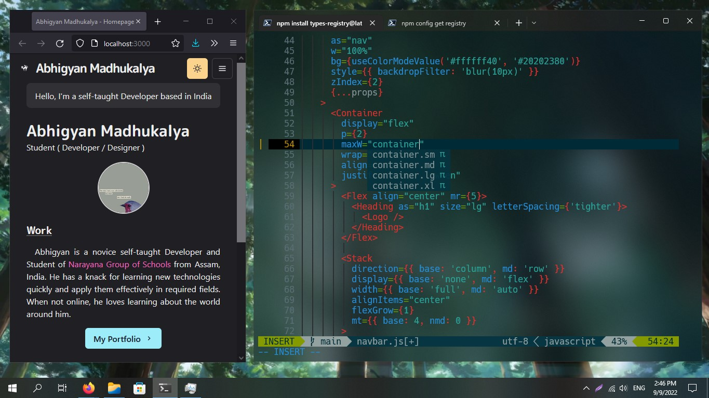
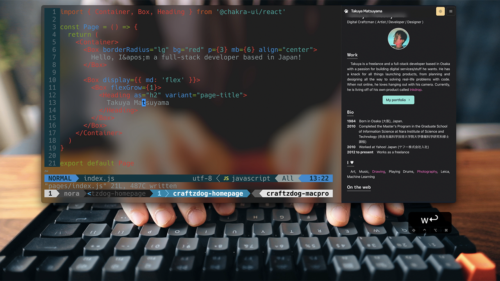

# Abhigyan's Homepage



## Tutorial

Watch [Takuya Matsuyama](https://github.com/craftzdog)'s tutorial on Youtube to make a similar homepage yourself:

[](https://www.youtube.com/watch?v=bSMZgXzC9AA)

Check out Takuya's own website [here](https://craftz.dog)

## Stack

- [Next.js](https://nextjs.org/) - A React framework with hybrid static & server rendering, and route pre-fetching, etc.
- [Chakra UI](https://chakra-ui.com/) - A simple, modular and accessible component library for React
- [Framer Motion](https://www.framer.com/motion/) - An animation library for React

## Project structure

```
$PROJECT_ROOT
│   # Page files
├── pages
│   # React component files
├── components
│   # Non-react modules
├── lib
│   # Static files for images and 3d model file
└── public
```
